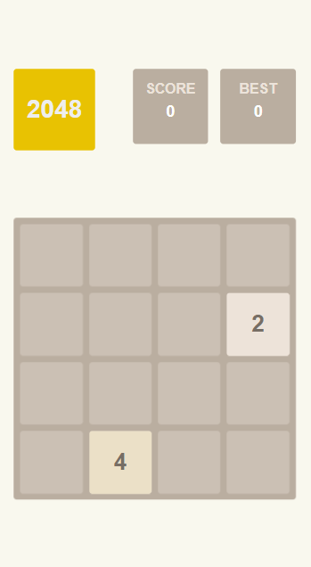

# 2048

Use Vanilla Javascript to build this little Game, and use Vite as build tool.

## How to play

#### By moving all tiles to one direction to merge the tiles that have the same number (all Tiles can only be moved in the same direction at a time). You can get the combined number score, try to achieve a total score of 2048 or higher.

- On the desktop or tablet, click the Arrow keys (up, down, left and right) to move.
- On the mobile or tablet, just touch and slide the directions (up, down, left and right) to move.

##### Go to [Website](https://2048-andy820621.vercel.app/) to enjoy this little game.



## Project Setup

```sh
npm install
```

### Compile and Hot-Reload for Development

```sh
npm run dev
```

### Compile and Minify for Production

```sh
npm run build
```
